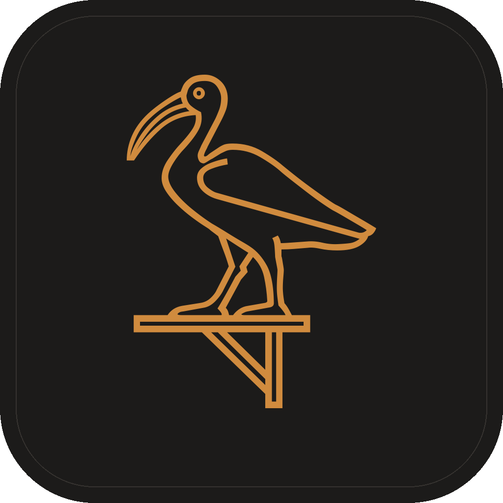
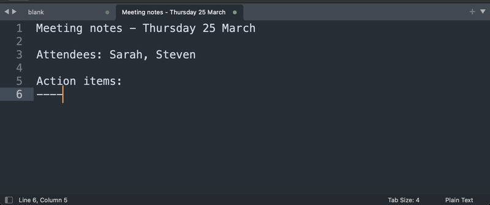

<div align="center">



# Thoth

### Scribe to the gods. Typist to you.

**Press a key. Speak. Text appears.**

**[Download for macOS](https://github.com/poodle64/thoth/releases/latest)**

[](https://tauri.app/)
[](https://www.rust-lang.org/)
[](https://svelte.dev/)
[](LICENCE)

[Getting Started](#getting-started) · [Features](#features) · [Build](#building-from-source) · [Docs](docs/product/)

</div>



Voice input on macOS is either cloud-dependent or requires complex setup. Thoth
runs speech-to-text **locally** using whisper.cpp with Metal GPU acceleration.
Nothing leaves the machine. No subscription. No cloud. No internet required.

---

## Getting Started

> After installing, Thoth checks for updates automatically and installs them in-app.

### First launch

macOS will block the app the first time you open it because it isn't from the App
Store. This is normal and only happens once.

1. Open the `.dmg` and drag Thoth to **Applications**
2. **Right-click** (or Control-click) the app and choose **Open**
3. Click **Open** in the dialogue that appears

<details>
<summary>Alternative: remove the block from Terminal</summary>

```bash
xattr -dr com.apple.quarantine /Applications/Thoth.app
```

</details>

### Setup

The app walks you through three quick steps:

1. **Download a speech model.** Click "Download Recommended Model" on the
   Overview tab (~1.5 GB, runs locally).
2. **Grant microphone access.** Click "Allow" when prompted so Thoth can hear
   you.
3. **Grant global shortcut access.** Click "Allow" so the recording hotkey works
   from any app (System Settings › Privacy & Security › Accessibility).
4. **Start dictating.** Press **F13** (the default shortcut), speak, and text
   appears at your cursor.

> **Tip:** F13 is the default. You can change it in Settings › Recording.

---

## Features

<table>
<tr>
<td width="50%">

**Offline Transcription**

- whisper.cpp with Metal GPU acceleration
- Nothing leaves your machine
- Works without internet
- Real-time voice activity detection

</td>
<td width="50%">

**AI Enhancement**

- Post-process with Ollama (local)
- Grammar, formatting, and tone correction
- Clipboard context awareness
- Custom prompts with templates

</td>
</tr>
<tr>
<td width="50%">

**Personal Dictionary**

- Custom vocabulary for domain terms
- Text replacement rules
- Prevents "dev" becoming "Dave"
- Import/export support

</td>
<td width="50%">

**Recording Options**

- Push-to-talk or hands-free mode
- VAD silence detection
- Configurable audio device
- Sound feedback (optional)

</td>
</tr>
<tr>
<td width="50%">

**History & Export**

- Searchable transcription history
- JSON/CSV/TXT export
- SQLite database
- Configurable retention

</td>
<td width="50%">

**Menu Bar App**

- macOS native (Apple Silicon)
- Global keyboard shortcuts
- Recording indicator near cursor
- Linux support planned

</td>
</tr>
</table>

---

## Building from Source

```bash
pnpm install
pnpm tauri dev    # Development build
pnpm tauri build  # Production build
```

<details>
<summary><strong>Requirements</strong></summary>

- macOS 14.0+ or Linux
- Rust 1.75+
- Node.js 20+
- pnpm

</details>

---

## Tech Stack

| Layer         | Choice     | Why                                                          |
| ------------- | ---------- | ------------------------------------------------------------ |
| Framework     | Tauri 2.0  | Native performance, cross-platform                           |
| Backend       | Rust       | Memory safety, audio performance                             |
| Frontend      | Svelte 5   | Reactive UI with runes                                       |
| Audio         | cpal       | Cross-platform audio capture                                 |
| Transcription | whisper-rs | whisper.cpp with Metal GPU acceleration (sherpa-rs fallback) |
| Database      | SQLite     | Local persistence with migrations                            |
| AI            | Ollama     | Local LLM enhancement                                        |

---

## Documentation

- **Product docs:** [docs/product/](docs/product/). Intent, workflows, design principles
- **Architecture:** [docs/architecture/](docs/architecture/). Audio pipeline, data model

---

## Acknowledgements

<strong>Core Technology</strong>

- [whisper.cpp](https://github.com/ggerganov/whisper.cpp). High-performance speech recognition with Metal GPU acceleration
- [whisper-rs](https://github.com/tazz4843/whisper-rs). Rust bindings for whisper.cpp
- [Sherpa-ONNX](https://github.com/k2-fsa/sherpa-onnx). Fallback speech recognition inference
- [NVIDIA Parakeet](https://catalog.ngc.nvidia.com/orgs/nvidia/teams/nemo/models/parakeet-tdt-1.1b). Speech-to-text models

<strong>Dependencies</strong>

- [Tauri](https://tauri.app/). Desktop application framework
- [cpal](https://github.com/RustAudio/cpal). Cross-platform audio
- [rubato](https://github.com/HEnquist/rubato). Audio resampling
- [enigo](https://github.com/enigo-rs/enigo). Cross-platform input simulation

<strong>Inspiration</strong>

- [MacWhisper](https://goodsnooze.gumroad.com/l/macwhisper). Proved that local Whisper transcription on macOS could be fast and practical
- [VoiceInk](https://voiceink.app/). Demonstrated seamless hotkey-to-cursor voice input
- [Spokenly](https://www.spokenly.app/). Showed how clean and minimal a dictation app could be

---

<div align="center">

**Your voice. Your machine. Nothing else.**

_Named after the Egyptian god of writing and wisdom, the scribe who faithfully records all that is spoken._

</div>
