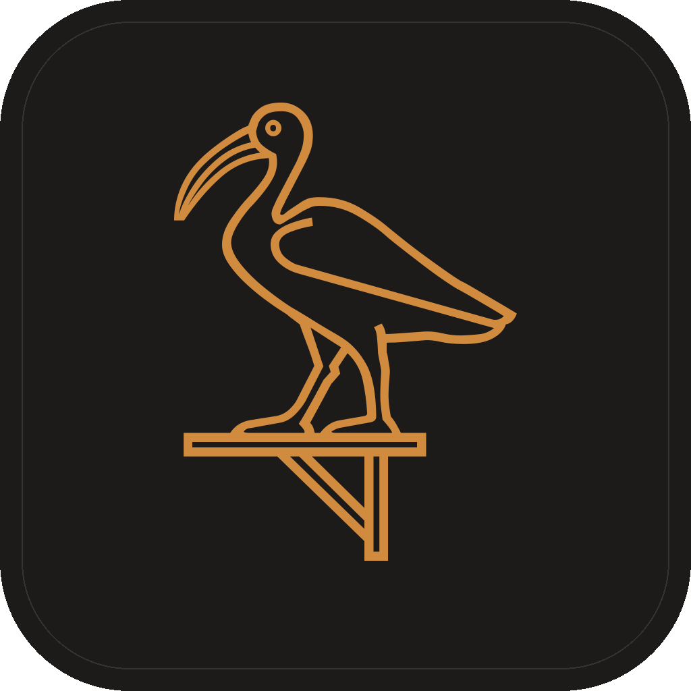
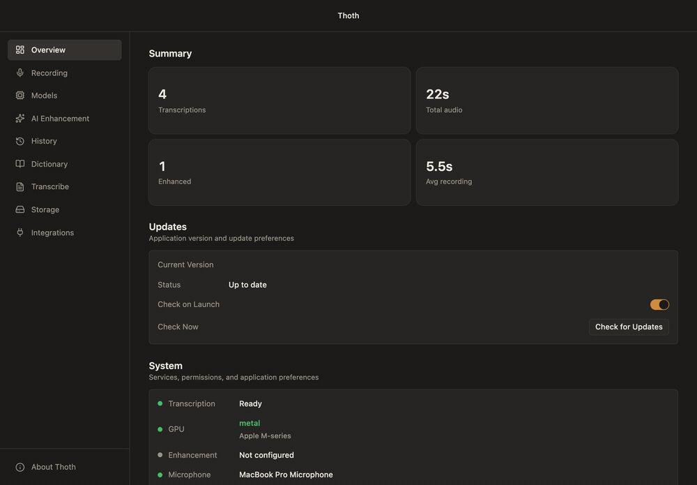
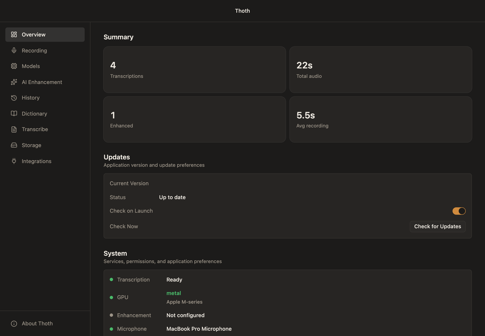

<div align="center">



# Thoth

### Scribe to the gods. Typist to you.

**Press a key. Speak. Text appears.**

**[Download for macOS](https://github.com/poodle64/thoth/releases/latest)** · **[Download for Linux](https://github.com/poodle64/thoth/releases/latest)**

[](https://tauri.app/)
[](https://www.rust-lang.org/)
[](https://svelte.dev/)
[](LICENCE)

[Installation](#installation) · [Features](#features) · [Documentation](#documentation) · [Contributing](#contributing)

</div>

<div align="center">

</div>

Voice input on the desktop is usually cloud-dependent, subscription-bound, or a
chore to set up. Thoth runs speech-to-text **entirely on your machine** with GPU
acceleration. Press a key in any app, speak, and the text lands at your cursor.
Nothing leaves the machine. No subscription, no cloud, no internet required.

---

## Features

<table>
<tr>
<td width="50%">

**Local, private transcription**

- Fastest on Apple Silicon: Parakeet on the Apple Neural Engine (CoreML), the recommended default
- Or whisper.cpp with GPU acceleration (Metal on macOS; CUDA/ROCm/Vulkan on Linux)
- A cross-platform Parakeet (sherpa-onnx) engine as well
- Nothing leaves your machine; no telemetry; works offline; voice-activity detection trims the silence

</td>
<td width="50%">

**Press a key, speak, paste**

- One toggle hotkey (default F13): press to start, press again to stop
- Text is inserted at the cursor in any app; your clipboard is preserved
- Import existing audio too (MP3, M4A, OGG, FLAC, WAV)
- Recording indicator near the cursor with subtle audio cues

</td>
</tr>
<tr>
<td width="50%">

**Smart correction**

- Register a name once and its mishearings snap to it (phonetic + spelling), with per-term safety so everyday words are left alone
- Australian/British spelling from the VARCON database, false-friend safe
- Optional spoken-number conversion ("twenty three" to 23)
- Filler-word, whitespace, and punctuation clean-up

</td>
<td width="50%">

**Optional AI enhancement**

- Post-process locally with Ollama or any OpenAI-compatible endpoint
- Built-in prompts (grammar, tone, conciseness, summarise) plus your own
- Length-constrained so it tidies without rewriting
- Opt-in and clipboard-context aware

</td>
</tr>
<tr>
<td width="50%">

**History and export**

- Searchable history with waveform playback
- Original and AI-enhanced versions side by side
- Export to JSON, CSV, or TXT
- Configurable retention; SQLite under the hood

</td>
<td width="50%">

**Automation and MCP**

- Opt-in loopback control API (token-authenticated, never network-exposed)
- A bundled Model Context Protocol server so an LLM assistant can drive the dictionary, settings, and history, or transcribe a file
- On by default for local assistants; toggle live, no restart

</td>
</tr>
</table>

<div align="center">

</div>

---

## Installation

> After installing, Thoth checks for updates automatically and installs them in-app.

### macOS

macOS will block the app the first time you open it because it isn't from the App
Store. This is normal and only happens once.

1. Open the `.dmg` and drag Thoth to **Applications**
2. **Right-click** (or Control-click) the app and choose **Open**
3. Click **Open** in the dialogue that appears

<details>
<summary>Alternative: remove the block from Terminal</summary>

```bash
xattr -dr com.apple.quarantine /Applications/Thoth.app
```

</details>

### Linux

1. Download the `.AppImage` (or `.deb`) from the [latest release](https://github.com/poodle64/thoth/releases/latest)
2. Make it executable: `chmod +x Thoth_*.AppImage`
3. Run it: `./Thoth_*.AppImage`

> For GPU-accelerated transcription, install `libvulkan1` and your GPU's Vulkan
> driver; without them Thoth falls back to CPU. See the
> [Troubleshooting guide](docs/troubleshooting.md) for Wayland and permission notes.

Once it's running, the [Getting Started guide](docs/getting-started.md) walks you
through downloading a model, granting permissions, and your first dictation.

---

## Tech Stack

| Layer         | Choice      | Why                                                          |
| ------------- | ----------- | ------------------------------------------------------------ |
| Framework     | Tauri 2.0   | Native performance, small binaries, cross-platform           |
| Backend       | Rust 2024   | Memory safety, audio performance                             |
| Frontend      | Svelte 5    | Reactive UI with runes                                       |
| Audio         | cpal        | Cross-platform audio capture                                 |
| Transcription | whisper.cpp | GPU-accelerated; Apple Neural Engine and sherpa-onnx options |
| Database      | SQLite      | Local persistence with migrations                            |
| AI            | Ollama      | Local LLM enhancement (or any OpenAI-compatible endpoint)    |
| Control API   | axum        | Loopback HTTP control surface for automation                 |
| MCP           | rmcp        | Bundled MCP server for LLM assistants                        |

---

## Documentation

| Guide                                                  | What it covers                                                             |
| ------------------------------------------------------ | -------------------------------------------------------------------------- |
| [Getting Started](docs/getting-started.md)             | First-run setup: download a model, grant permissions, your first dictation |
| [Personal Dictionary](docs/dictionary.md)              | Custom vocabulary and smart name correction (the canonical registry)       |
| [AI Enhancement Prompts](docs/custom-prompts-guide.md) | Writing effective prompts for the optional Ollama post-processing          |
| [Automation and MCP](docs/automation.md)               | The control API and MCP server for driving Thoth from an LLM assistant     |
| [Troubleshooting](docs/troubleshooting.md)             | Hotkeys, permissions, paste, GPU, and Wayland gotchas                      |
| [Product docs](docs/product/)                          | Intent, workflows, and design principles                                   |

---

## Contributing

```bash
pnpm install
pnpm tauri dev    # Development build
pnpm tauri build  # Production build
```

<details>
<summary><strong>Requirements</strong></summary>

- macOS 14.0+ or Linux
- Rust 1.87+ (2024 edition)
- Node.js 20+
- pnpm

</details>

<details>
<summary><strong>Linux GPU acceleration</strong></summary>

whisper.cpp supports GPU acceleration on Linux. Choose the backend that matches your hardware:

| GPU                  | Feature Flag         | Requirements                            |
| -------------------- | -------------------- | --------------------------------------- |
| NVIDIA               | `--features cuda`    | CUDA Toolkit 12.x, NVIDIA drivers       |
| AMD                  | `--features hipblas` | ROCm 6.x                                |
| Any (vendor-neutral) | `--features vulkan`  | Vulkan drivers (what the release ships) |

```bash
pnpm tauri build -- --no-default-features --features vulkan   # what the Linux release ships
pnpm tauri build -- --no-default-features --features cuda     # NVIDIA
pnpm tauri build -- --no-default-features --features hipblas  # AMD
```

Building from source needs the Linux system libraries and the Vulkan toolchain; see
[docs/development/linux-setup.md](docs/development/linux-setup.md) for the full dependency
list, runtime packages, and display-server notes. If GPU initialisation fails at runtime,
Thoth falls back to CPU automatically.

</details>

---

<div align="center">

**Your voice. Your machine. Nothing else.**

_Named after the Egyptian god of writing and wisdom, the scribe who faithfully records all that is spoken._

Built on [whisper.cpp](https://github.com/ggerganov/whisper.cpp), [Tauri](https://tauri.app/), [cpal](https://github.com/RustAudio/cpal), and [sherpa-onnx](https://github.com/k2-fsa/sherpa-onnx). Inspired by [MacWhisper](https://goodsnooze.gumroad.com/l/macwhisper), [VoiceInk](https://voiceink.app/), and [Spokenly](https://www.spokenly.app/).

<sub><a href="LICENCE">MIT Licence</a> · <a href="https://github.com/poodle64/thoth/issues">Report a bug</a> · <a href="CHANGELOG.md">Changelog</a></sub>

</div>
