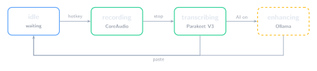

# Thoth Architecture Overview

## System Overview

Thoth is a native macOS voice-to-text application built with Tauri 2.0, featuring a Rust backend and Svelte 5 frontend. It operates as a menu bar application with audio recording, local transcription (whisper.cpp with Metal GPU acceleration), and optional AI enhancement via Ollama.

## State Machine



The application workflow is managed by `PipelineState`:

- **idle**: Waiting for hotkey trigger
- **recording**: Capturing audio via cpal
- **transcribing**: Processing audio with whisper.cpp or Sherpa-ONNX
- **filtering**: Applying dictionary replacements and output filtering
- **enhancing**: Optional AI enhancement via Ollama
- **outputting**: Copying to clipboard and/or pasting at cursor
- **completed**: Pipeline finished successfully
- **failed**: Pipeline failed with error

## High-Level Architecture

```
┌─────────────────────────────────────────────────────────────┐
│                     Tauri Application                        │
├─────────────────────────────────────────────────────────────┤
│  Frontend (Svelte 5 + SvelteKit)                             │
│  ┌─────────────┐  ┌─────────────┐  ┌─────────────────────┐  │
│  │   Settings  │  │   History   │  │   Recording         │  │
│  │   Window    │  │   Window    │  │   Indicator         │  │
│  └──────┬──────┘  └──────┬──────┘  └──────────┬──────────┘  │
│         └────────────────┴───────────────────┬┘             │
│                          │                                   │
│                Tauri Commands & Events                       │
│                          │                                   │
├──────────────────────────┼───────────────────────────────────┤
│  Backend (Rust)          ▼                                   │
│  ┌─────────────────────────────────────────────────────────┐ │
│  │                    Pipeline                              │ │
│  │  (Recording → Transcription → Filtering → Enhancement)  │ │
│  └───────────────────────────────────────────────────────┬─┘ │
│         ┌──────────────┬──────────────┬──────────────────┤   │
│         ▼              ▼              ▼                  ▼   │
│  ┌─────────────┐ ┌───────────┐ ┌─────────────┐ ┌───────────┐│
│  │    Audio    │ │Transcription││ Enhancement │ │  Database ││
│  │ (cpal, VAD) │ │(whisper.cpp)│ │  (Ollama)   │ │ (SQLite)  ││
│  └─────────────┘ └───────────┘ └─────────────┘ └───────────┘│
└─────────────────────────────────────────────────────────────┘
```

## Rust Backend Modules

The backend is organised into focused modules in `src-tauri/src/`:

### Core Orchestration

| Module        | Description                                                                 |
| ------------- | --------------------------------------------------------------------------- |
| `lib.rs`      | Application entry point, Tauri setup, plugin registration, command handlers |
| `pipeline.rs` | Transcription pipeline orchestration (recording → transcription → output)   |
| `config.rs`   | Application configuration management (persisted to disk)                    |

### Audio Subsystem (`audio/`)

| Module           | Description                                                |
| ---------------- | ---------------------------------------------------------- |
| `mod.rs`         | Audio subsystem coordination, global recorder instances    |
| `capture.rs`     | Audio capture using cpal (cross-platform audio library)    |
| `device.rs`      | Audio device enumeration and selection                     |
| `format.rs`      | Audio format conversion (resampling to 16kHz mono)         |
| `metering.rs`    | Real-time audio level metering                             |
| `preview.rs`     | Audio preview for device testing                           |
| `ring_buffer.rs` | Lock-free ring buffer for audio samples                    |
| `vad.rs`         | Voice Activity Detection for auto-stop and hands-free mode |

### Transcription Subsystem (`transcription/`)

| Module        | Description                                                   |
| ------------- | ------------------------------------------------------------- |
| `mod.rs`      | Transcription service abstraction (dual backend support)      |
| `whisper.rs`  | whisper.cpp integration with Metal GPU acceleration (primary) |
| `parakeet.rs` | Sherpa-ONNX with Parakeet models (fallback)                   |
| `manifest.rs` | Model manifest fetching and management                        |
| `download.rs` | Model download with progress tracking                         |
| `filter.rs`   | Output filtering (filler words, formatting)                   |

### AI Enhancement (`enhancement/`)

| Module       | Description                                    |
| ------------ | ---------------------------------------------- |
| `mod.rs`     | Enhancement service coordination               |
| `ollama.rs`  | Ollama client for local LLM enhancement        |
| `context.rs` | Context capture (clipboard, selected text)     |
| `prompts.rs` | Built-in and custom prompt template management |

### Database (`database/`)

| Module             | Description                   |
| ------------------ | ----------------------------- |
| `mod.rs`           | SQLite connection management  |
| `migrations.rs`    | Database schema migrations    |
| `schema.rs`        | Table definitions             |
| `transcription.rs` | Transcription CRUD operations |

### Input Handling

| Module       | Description                               |
| ------------ | ----------------------------------------- |
| `shortcuts/` | Global hotkey registration and management |
| `ptt.rs`     | Push-to-talk mode handling                |
| `handsfree/` | Hands-free VAD-based automatic recording  |

### Output Handling

| Module           | Description                                       |
| ---------------- | ------------------------------------------------- |
| `clipboard.rs`   | Clipboard operations with history and restoration |
| `text_insert.rs` | Text insertion (typing simulation or paste)       |
| `dictionary.rs`  | Custom vocabulary and replacement rules           |
| `export.rs`      | Export transcriptions to JSON, CSV, or TXT        |

### Platform & UI

| Module                   | Description                                                          |
| ------------------------ | -------------------------------------------------------------------- |
| `platform/`              | Platform-specific code (macOS accessibility, microphone permissions) |
| `recording_indicator.rs` | Recording indicator window management                                |
| `traffic_lights.rs`      | macOS window traffic light positioning                               |
| `tray.rs`                | System tray setup                                                    |
| `sound.rs`               | Audio feedback (recording start/stop sounds)                         |
| `commands/`              | Miscellaneous Tauri commands                                         |

## Frontend Structure

The frontend is built with Svelte 5 and SvelteKit in `src/`:

### Windows (`lib/windows/`)

| Component         | Description                                         |
| ----------------- | --------------------------------------------------- |
| `Settings.svelte` | Main settings window with tabs for configuration    |
| `History.svelte`  | Transcription history viewer with search and export |
| `Recorder.svelte` | Recording interface with audio visualisation        |

### Components (`lib/components/`)

| Component                      | Description                                |
| ------------------------------ | ------------------------------------------ |
| `AIEnhancementSettings.svelte` | Ollama model and prompt configuration      |
| `AudioDeviceSelector.svelte`   | Input device selection dropdown            |
| `AudioPlayer.svelte`           | WAV audio playback with waveform display   |
| `AudioVisualizer.svelte`       | Real-time audio level display              |
| `DateRangePicker.svelte`       | Date range selection for history filtering |
| `DictionaryEditor.svelte`      | Custom vocabulary and replacement editor   |
| `ExportDialog.svelte`          | Export format selection dialogue           |
| `FilterSettings.svelte`        | Output filter configuration                |
| `HistoryFilterPanel.svelte`    | History search and filter controls         |
| `HistoryItem.svelte`           | Individual transcription display           |
| `HistoryList.svelte`           | Transcription list with virtual scrolling  |
| `ModelManager.svelte`          | Model download and selection               |
| `PerformanceDialog.svelte`     | Transcription performance statistics       |
| `ShortcutInput.svelte`         | Hotkey capture input                       |

### Stores (`lib/stores/`)

Svelte 5 runes-based state management:

| Store                  | Description                           |
| ---------------------- | ------------------------------------- |
| `pipeline.svelte.ts`   | Pipeline state and transcription flow |
| `config.svelte.ts`     | Application configuration             |
| `settings.svelte.ts`   | UI settings and preferences           |
| `shortcuts.svelte.ts`  | Global hotkey configuration           |
| `history.svelte.ts`    | Transcription history state           |
| `dictionary.svelte.ts` | Dictionary entries state              |
| `clipboard.svelte.ts`  | Clipboard operations and history      |
| `sound.svelte.ts`      | Sound feedback settings               |

### Routes (`routes/`)

SvelteKit routing with special windows:

- `/` - Main application entry
- `/(indicator)/` - Recording indicator overlay window

## Communication

### Tauri Commands

Frontend invokes Rust functions via `@tauri-apps/api/core`:

```typescript
import { invoke } from '@tauri-apps/api/core';

// Start recording
const audioPath = await invoke<string>('start_recording');

// Transcribe audio
const text = await invoke<string>('transcribe_file', { audioPath });
```

### Tauri Events

Backend emits events to frontend via `tauri::Emitter`:

```rust
// Rust: emit event
app_handle.emit("pipeline-state", &state)?;
app_handle.emit("vad-event", &vad_event)?;

// TypeScript: listen for events
import { listen } from '@tauri-apps/api/event';
await listen<PipelineState>('pipeline-state', (event) => {
    state = event.payload;
});
```

## Data Flow

```
┌─────────────┐    ┌─────────────┐    ┌─────────────┐
│   Hotkey    │───▶│  Recording  │───▶│    WAV      │
│   Trigger   │    │   (cpal)    │    │    File     │
└─────────────┘    └─────────────┘    └──────┬──────┘
                                             │
                                             ▼
┌─────────────┐    ┌─────────────┐    ┌─────────────┐
│  Output     │◀───│  Filtering  │◀───│Transcription│
│  (paste)    │    │ (dictionary)│    │ (whisper)   │
└─────────────┘    └─────────────┘    └─────────────┘
       │
       ▼
┌─────────────┐    ┌─────────────┐
│  Database   │◀───│ Enhancement │ (optional)
│  (SQLite)   │    │  (Ollama)   │
└─────────────┘    └─────────────┘
```

1. **Trigger**: Global hotkey activates recording
2. **Recording**: cpal captures audio to 16kHz mono WAV file
3. **Transcription**: whisper.cpp (Metal GPU) or Sherpa-ONNX converts speech to text
4. **Filtering**: Dictionary replacements applied, filler words removed
5. **Enhancement**: Optional AI enhancement via local Ollama
6. **Output**: Text copied to clipboard and/or pasted at cursor
7. **History**: Transcription saved to SQLite database

## Data Storage

**Design Decision**: All user data lives in `~/.thoth` to keep the app's footprint contained in one place. This makes it easy to find, backup, and remove.

| Data Type        | Location               | Notes                             |
| ---------------- | ---------------------- | --------------------------------- |
| Database         | `~/.thoth/thoth.db`    | SQLite (transcriptions, settings) |
| Audio Recordings | `~/.thoth/Recordings/` | WAV files                         |
| Whisper Models   | `~/.thoth/Models/`     | GGML model files                  |
| Configuration    | `~/.thoth/config.json` | App settings                      |
| Logs             | `~/.thoth/logs/`       | Debug logs                        |
| Custom Prompts   | `~/.thoth/prompts/`    | User prompt templates             |

### Uninstall

To completely remove Thoth:

1. Manually: `rm -rf ~/.thoth` then drag app to Trash
2. This removes all data, models, and configuration

## Threading Model

| Component      | Thread/Queue      | Notes                             |
| -------------- | ----------------- | --------------------------------- |
| Svelte UI      | Main Thread       | All UI updates                    |
| Tauri Commands | Tokio Runtime     | Async command handlers            |
| Audio Capture  | Dedicated Thread  | Real-time audio callback via cpal |
| Transcription  | Background Thread | whisper.cpp processing            |
| AI Enhancement | Async Task        | HTTP requests to Ollama           |

## External Dependencies

| Dependency  | Purpose               | Integration                 |
| ----------- | --------------------- | --------------------------- |
| tauri       | Desktop app framework | Core framework              |
| cpal        | Cross-platform audio  | Audio capture               |
| whisper-rs  | whisper.cpp bindings  | Transcription (Metal GPU)   |
| sherpa-onnx | ONNX runtime          | Transcription (fallback)    |
| rusqlite    | SQLite bindings       | Database                    |
| reqwest     | HTTP client           | Ollama API, model downloads |
| serde       | Serialisation         | Config, IPC                 |
| tracing     | Logging               | Structured logging          |
